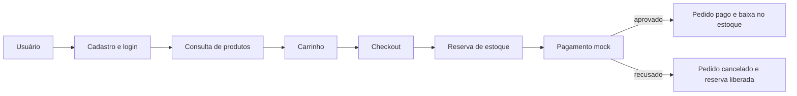
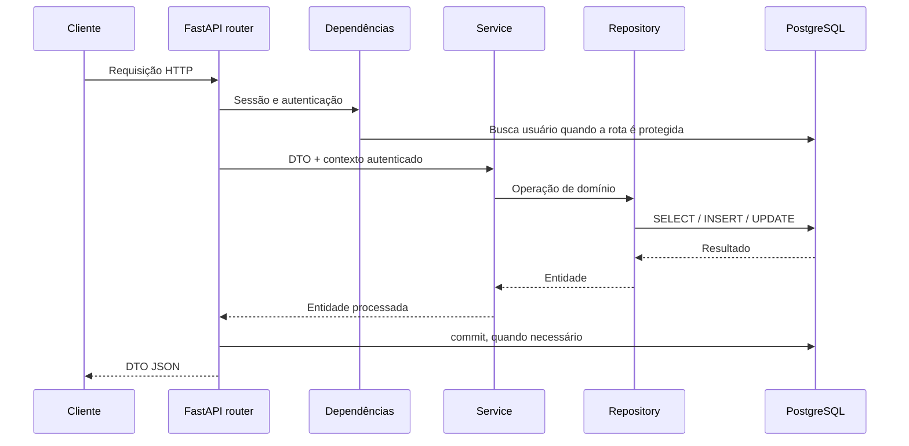

# Funcionamento da Ecommerce API

Este documento registra como a API está organizada, quais decisões foram tomadas
e onde estão as regras que exigem mais atenção. Ele complementa o README da raiz:
o README apresenta o projeto; este arquivo serve como referência técnica para
manutenção, estudo e evolução.

## 1. Visão geral

A aplicação é uma API REST assíncrona construída com FastAPI. Ela usa PostgreSQL
como banco relacional, SQLAlchemy 2.0 para persistência, Alembic para migrações e
Pydantic para validar contratos HTTP e configurações.

O fluxo principal implementado é:



## 2. Stack e responsabilidades

| Tecnologia | Responsabilidade |
|---|---|
| FastAPI | Rotas, injeção de dependências e OpenAPI |
| Pydantic v2 | Validação de entrada, saída e configurações |
| SQLAlchemy 2.0 async | Modelos, consultas e sessões assíncronas |
| asyncpg | Driver assíncrono do PostgreSQL |
| Alembic | Versionamento do schema do banco |
| pwdlib + Argon2 | Hash e verificação de senhas |
| PyJWT | Criação e validação dos access tokens |
| pytest + pytest-asyncio | Testes assíncronos |
| HTTPX | Requisições ASGI nos testes de endpoints |
| Ruff | Lint e formatação |
| Taskipy | Atalhos de comandos do projeto |

## 3. Organização do código

```text
app/
├── core/
│   ├── config.py          # Variáveis de ambiente
│   ├── database.py        # Engine, fábrica de sessões e dependência
│   └── security.py        # Argon2 e JWT
├── migrations/            # Ambiente e revisões do Alembic
├── modules/
│   ├── auth/
│   ├── user/
│   ├── product/
│   ├── stock/
│   ├── cart/
│   ├── order/
│   └── payment/
├── scripts/seed.py        # Categorias e produtos de demonstração
├── shared/                # BaseModel, enums, exceções e handlers
├── tests/
│   ├── unit/
│   └── integration/
├── main.py                # Construção da aplicação e registro das rotas
└── models.py              # Import central dos modelos para o Alembic
```

### Camadas de cada módulo

- `router.py`: adapta HTTP para a aplicação, resolve dependências e confirma a
  transação com `commit()` quando há escrita.
- `schemas.py`: define DTOs de entrada e saída com Pydantic.
- `mapper.py`: converte schemas, entidades e respostas sem regras de negócio.
- `service.py`: concentra regras, validações e orquestrações do domínio.
- `repository.py`: executa consultas e operações de persistência.
- `models.py`: representa tabelas, relacionamentos e constraints.
- `enums.py`: define estados e operações válidas do módulo.

O projeto faz a composição dos services manualmente dentro das rotas. O FastAPI é
usado para injetar recursos ligados à requisição, principalmente sessão, usuário
autenticado e autorização de administrador.

## 4. Ciclo de uma requisição



1. O Pydantic valida path, query, headers e corpo da requisição.
2. As dependências abrem uma `AsyncSession` e, quando necessário, autenticam o
   usuário.
3. O router instancia repositories e services.
4. O service aplica regras de negócio e usa o repository.
5. O repository usa `flush()` para sincronizar mudanças sem encerrar a transação.
6. O router executa `commit()` quando toda a operação foi concluída.
7. O mapper constrói o DTO de saída e o FastAPI serializa a resposta.

## 5. Configuração e ambiente

As configurações são carregadas por `app/core/config.py` usando
`pydantic-settings`. A aplicação espera:

| Variável | Uso |
|---|---|
| `DATABASE_URL` | Conexão SQLAlchemy no formato `postgresql+asyncpg://...` |
| `JWT_SECRET_KEY` | Assinatura dos tokens; deve possuir ao menos 32 bytes |
| `JWT_ALGORITHM` | Algoritmo JWT, atualmente `HS256` |
| `JWT_ACCESS_TOKEN_EXPIRE_MINUTES` | Duração do access token |

O Docker Compose também lê `POSTGRES_DB`, `POSTGRES_USER`, `POSTGRES_PASSWORD` e
`POSTGRES_PORT` para criar o banco.

Ponto importante: `env_file="../.env"` foi configurado considerando que os
comandos Python são executados dentro da pasta `api`. Executar a aplicação a partir
de outro diretório pode exigir variáveis já exportadas no ambiente ou ajuste do
caminho.

O arquivo `.env` é local e ignorado pelo Git. O `.env.example` contém apenas o
modelo das variáveis e deve continuar sem segredos reais.

## 6. Banco, sessões e transações

### Engine e sessão

`create_async_engine()` cria o engine compartilhado pela aplicação.
`async_sessionmaker()` cria uma nova sessão por uso da dependência `get_session()`.
Uma sessão não equivale necessariamente a uma conexão física permanente: o engine
administra um pool e a sessão obtém conexões quando precisa consultar o banco.

`expire_on_commit=False` mantém os atributos já carregados acessíveis depois do
commit. Algumas rotas ainda usam `refresh()` para buscar valores gerados pelo banco,
como timestamps.

### `flush`, `commit` e `rollback`

- `flush()`: envia mudanças pendentes ao banco dentro da transação atual. Ele gera
  IDs e detecta constraints, mas ainda permite rollback.
- `commit()`: confirma definitivamente todas as mudanças da transação.
- `rollback()`: desfaz as mudanças ainda não confirmadas e recupera a sessão após
  determinados erros.

Services e repositories não fazem commit. Essa responsabilidade fica no limite da
requisição, dentro do router, para que uma operação composta seja atômica. Se uma
etapa do checkout falhar antes do commit, pedido, pagamento, carrinho e reservas não
devem ficar parcialmente persistidos.

### Modelo base

Todas as entidades herdam de `BaseModel` e recebem:

- `id`: UUID gerado na aplicação com `uuid4`;
- `criado_em`: timestamp gerado pelo banco;
- `atualizado_em`: timestamp inicial e atualização automática pelo SQLAlchemy.

### Migrações

O Alembic usa `BaseModel.metadata`. O arquivo `app/models.py` importa todos os
modelos para que o autogenerate conheça as tabelas.

```powershell
# Aplicar todas as migrações
alembic upgrade head

# Conferir a revisão atual
alembic current

# Criar uma revisão após alterar modelos
alembic revision --autogenerate -m "descricao da mudanca"

# Voltar uma revisão em desenvolvimento
alembic downgrade -1
```

Toda migração autogerada deve ser revisada antes de ser aplicada, especialmente
enums, constraints, índices, defaults e ordem do `downgrade()`.

## 7. Modelo de dados

| Entidade | Papel principal |
|---|---|
| `User` | Conta, credenciais, role e estado ativo |
| `Address` | Endereço pertencente a um usuário |
| `Category` | Agrupamento dos produtos; atualmente criado pelo seed |
| `Product` | Item vendável com SKU, slug, preço e status ativo |
| `Stock` | Quantidade física e quantidade reservada de um produto |
| `Cart` | Carrinho de um usuário com estado próprio |
| `CartItem` | Produto, quantidade e preço corrente no carrinho |
| `Order` | Pedido com totais e snapshot do endereço |
| `OrderItem` | Snapshot de produto, SKU, quantidade e preços |
| `Payment` | Pagamento único associado a um pedido |

Relações relevantes:

- usuário possui vários endereços;
- usuário pode possuir vários carrinhos e pedidos;
- categoria possui vários produtos;
- cada produto possui no máximo um registro de estoque;
- carrinho possui vários itens, sem repetir produto no mesmo carrinho;
- pedido possui vários itens e exatamente um pagamento;
- exclusões usam `CASCADE` apenas onde a dependência pode desaparecer junto; dados
  históricos de pedidos usam `RESTRICT` e snapshots.

## 8. Autenticação e autorização

### Cadastro

`POST /auth/register` valida os dados, aplica Argon2 na senha e normaliza o e-mail
para minúsculas. E-mail e CPF são únicos. A resposta nunca expõe `senha_hash`.

### Login e JWT

`POST /auth/login` busca o e-mail normalizado, verifica a senha e bloqueia usuários
inativos. O JWT contém:

```json
{
  "sub": "uuid-do-usuario",
  "exp": "momento-de-expiracao"
}
```

O token é assinado com a chave e o algoritmo do ambiente. A API devolve o token no
corpo e não cria cookies. O cliente deve enviá-lo nas rotas protegidas:

```http
Authorization: Bearer <access_token>
```

A cada requisição protegida, `get_current_user` decodifica o token, converte `sub`
para UUID, busca o usuário no banco e confirma que ele continua ativo. Portanto,
desativar uma conta invalida o acesso mesmo antes do token expirar.

### RBAC

- `CurrentUser`: exige qualquer usuário autenticado e ativo.
- `AdminUser`: executa `require_admin` depois da autenticação e exige role `ADMIN`.
- ausência ou token inválido retorna `401`;
- usuário válido sem permissão retorna `403`.

O projeto possui apenas access token. Refresh token, revogação explícita e rotação
de chaves não estão implementados.

## 9. Erros padronizados

Erros conhecidos da aplicação herdam de `AppException`. O handler global converte
essas exceções e erros de validação do FastAPI para o mesmo contrato:

```json
{
  "code": "PRODUCT_NOT_FOUND",
  "message": "Produto nao encontrado.",
  "details": {
    "product_id": "uuid"
  }
}
```

| Exceção | Status HTTP |
|---|---|
| `BusinessRuleException` | `400 Bad Request` |
| `UnauthorizedException` | `401 Unauthorized` |
| `ForbiddenException` | `403 Forbidden` |
| `NotFoundException` | `404 Not Found` |
| `ConflictException` | `409 Conflict` |
| `RequestValidationError` | `422 Unprocessable Content` |

O código estável em `code` é mais apropriado para decisões do frontend do que o
texto humano de `message`.

## 10. Regras por módulo

### User

- e-mail é removido de espaços externos e convertido para minúsculas;
- e-mail e CPF não podem se repetir;
- CPF precisa possuir exatamente 11 dígitos;
- senha de entrada precisa ter de 8 a 128 caracteres;
- estado do endereço é normalizado para duas letras maiúsculas;
- o endereço é sempre associado ao usuário autenticado pelo backend.

### Product

- nome não pode ficar vazio depois de `strip()`;
- SKU é normalizado para maiúsculas e deve ser único;
- preço deve ser positivo;
- categoria precisa existir;
- slug é criado a partir do nome e recebe sufixos `-2`, `-3` etc. em colisões;
- produtos inativos não aparecem nas rotas públicas;
- atualização usa `PATCH` e altera somente campos enviados;
- alterar o nome não altera o slug atual, preservando URLs já divulgadas;
- `descricao` pode ser explicitamente removida com `null`.

As categorias ainda não possuem endpoints públicos ou administrativos. Elas são
carregadas pelo seed ou manipuladas diretamente no banco durante o desenvolvimento.

### Stock

O estoque mantém três conceitos:

```text
quantidade_disponivel = quantidade - quantidade_reservada
```

- `quantidade`: total físico registrado;
- `quantidade_reservada`: unidades separadas por pedidos aguardando pagamento;
- `quantidade_disponivel`: propriedade calculada e não armazenada.

Entradas aumentam o total. Saídas administrativas diminuem apenas a quantidade
disponível. Valores negativos e reservas acima do total são impedidos por regras de
serviço e constraints do banco.

Operações mutáveis buscam o estoque com `SELECT ... FOR UPDATE`. Assim, transações
concorrentes não confirmam venda sobre o mesmo valor antigo.

### Cart

- existe no máximo um carrinho `OPEN` por usuário, garantido por índice único
  parcial no PostgreSQL;
- consultar `/cart` cria um carrinho aberto quando ele ainda não existe;
- o mesmo produto não é duplicado: uma nova adição soma a quantidade;
- quantidade deve ser positiva;
- produto precisa estar ativo e possuir estoque disponível;
- um usuário não consegue alterar itens pertencentes a outro carrinho;
- `preco_unitario_atual` é atualizado ao adicionar ou editar o item;
- `total_estimado` é calculado na resposta e ainda pode mudar antes do checkout.

O carrinho é bloqueado para atualização durante mutações. Como uma consulta não
consegue bloquear uma linha que ainda não existe, o índice parcial continua sendo a
garantia final contra dois primeiros carrinhos abertos simultâneos.

### Order e checkout

O checkout executa, dentro da mesma transação:

1. bloqueia e carrega o carrinho aberto com seus itens;
2. impede checkout de carrinho vazio;
3. confirma que o endereço pertence ao usuário autenticado;
4. ordena itens por UUID do produto para manter uma ordem previsível de locks;
5. valida o produto e reserva a quantidade de cada estoque;
6. calcula os totais usando o preço atual do produto;
7. cria snapshots de produto, SKU, preço e endereço;
8. cria pedido `PENDING_PAYMENT` e pagamento `PENDING` com gateway `MOCK`;
9. fecha o carrinho como `CLOSED`;
10. confirma tudo com um único commit na rota.

Os snapshots preservam o histórico mesmo que produto, preço ou endereço sejam
alterados depois. O frete está preparado no service, mas o endpoint atual usa o
valor padrão `0.00`.

Clientes listam apenas os próprios pedidos. Na consulta por ID, um administrador
pode consultar qualquer pedido; para clientes, um pedido alheio é apresentado como
não encontrado para evitar vazamento de existência.

### Payment

Transições permitidas:

| Estado atual | Próximo estado | Efeito no pedido e estoque |
|---|---|---|
| `PENDING` | `APPROVED` | Confirma reserva, baixa o total e marca pedido `PAID` |
| `PENDING` | `REFUSED` | Libera reserva e marca pedido `CANCELED` |
| `APPROVED` | `REFUNDED` | Devolve quantidade e marca pedido `CANCELED` |

Qualquer outra transição retorna conflito. O método de refund existe no service,
mas ainda não possui endpoint HTTP.

As rotas manuais de aprovação e recusa exigem administrador. O webhook mock aceita
somente resultado `APPROVED` ou `REFUSED` e exige:

- header `Idempotency-Key`, de 1 a 100 caracteres;
- `payment_id`;
- `status`;
- `gateway_transaction_id`, de 1 a 100 caracteres.

A mesma chave com o mesmo evento devolve o pagamento já processado sem repetir
efeitos. Reutilizar a chave com outro payload ou reutilizar a transação do gateway
em outro pagamento gera `409`. Constraints únicas e recuperação após
`IntegrityError` protegem também disputas concorrentes.

O pagamento é bloqueado com `FOR UPDATE`; atualizações de estoque também usam lock.
Os itens são processados em ordem estável de produto para reduzir risco de deadlock.

O webhook atual é público porque simula um gateway. Antes de produção, ele precisa
validar assinatura do provedor, timestamp, origem e política de repetição.

## 11. Endpoints

### Infraestrutura e autenticação

| Método | Rota | Acesso | Resultado |
|---|---|---|---|
| `GET` | `/health` | Público | Estado básico da API |
| `POST` | `/auth/register` | Público | Cria usuário (`201`) |
| `POST` | `/auth/login` | Público | Retorna access token |
| `GET` | `/users/me` | Autenticado | Dados do usuário atual |
| `POST` | `/users/me/addresses` | Autenticado | Cria endereço (`201`) |

### Produtos e estoque

| Método | Rota | Acesso | Resultado |
|---|---|---|---|
| `GET` | `/products` | Público | Lista produtos ativos |
| `GET` | `/products/by-slug/{slug}` | Público | Busca produto pelo slug |
| `GET` | `/products/{product_id}` | Público | Busca produto pelo UUID |
| `POST` | `/admin/products` | `ADMIN` | Cria produto (`201`) |
| `PATCH` | `/admin/products/{product_id}` | `ADMIN` | Atualiza campos enviados |
| `POST` | `/admin/products/{product_id}/stock` | `ADMIN` | Cria estoque (`201`) |
| `GET` | `/admin/products/{product_id}/stock` | `ADMIN` | Consulta estoque |
| `PATCH` | `/admin/products/{product_id}/stock` | `ADMIN` | Entrada ou saída de estoque |

`GET /products` aceita `nome`, `categoria_id`, `offset` e `limit`. O `limit` varia
de 1 a 100 e o padrão é 20.

### Carrinho e pedidos

| Método | Rota | Acesso | Resultado |
|---|---|---|---|
| `GET` | `/cart` | Autenticado | Obtém ou cria carrinho aberto |
| `POST` | `/cart/items` | Autenticado | Adiciona item (`201`) |
| `PATCH` | `/cart/items/{item_id}` | Autenticado | Substitui a quantidade |
| `DELETE` | `/cart/items/{item_id}` | Autenticado | Remove item (`204`) |
| `POST` | `/orders/checkout` | Autenticado | Cria pedido (`201`) |
| `GET` | `/orders` | Autenticado | Lista pedidos próprios |
| `GET` | `/orders/{order_id}` | Autenticado | Consulta pedido autorizado |

`GET /orders` aceita `offset` e `limit`, com limite máximo de 100.

### Pagamentos

| Método | Rota | Acesso | Resultado |
|---|---|---|---|
| `POST` | `/payments/webhook/mock` | Mock externo | Processa evento idempotente |
| `POST` | `/payments/{payment_id}/approve` | `ADMIN` | Aprova pagamento pendente |
| `POST` | `/payments/{payment_id}/refuse` | `ADMIN` | Recusa pagamento pendente |

Com o servidor ligado, o contrato completo de schemas pode ser consultado em
`http://localhost:8000/docs` ou `http://localhost:8000/redoc`.

## 12. Dados iniciais

Com o PostgreSQL em execução e as migrações aplicadas, rode dentro de `api`:

```powershell
task seed
```

Alternativa sem o executável do Taskipy:

```powershell
python -m app.scripts.seed
```

O seed cria três categorias e seis produtos de demonstração. Ele é idempotente no
escopo atual: categorias são identificadas pelo slug e produtos pelo SKU, portanto
pode ser executado novamente sem duplicá-los. Ele não cria usuários, endereços nem
estoque.

## 13. Execução local

A partir da raiz do repositório:

```powershell
Copy-Item .env.example .env
docker compose up -d db
```

Edite o `.env`, depois execute dentro de `api`:

```powershell
python -m pip install -e ".[dev]"
alembic upgrade head
task seed
uvicorn app.main:app --reload
```

Comandos úteis:

```powershell
task lint
task format
task test
docker compose logs -f db
docker compose stop db
```

O volume nomeado `postgres_data` mantém os dados quando o container é parado ou
recriado. `docker compose down -v` também remove esse volume e apaga os dados locais.

## 14. Testes

Os testes estão separados primeiro por tipo e depois por módulo:

```text
app/tests/
├── unit/
│   ├── auth/
│   ├── cart/
│   ├── core/
│   ├── order/
│   ├── payment/
│   ├── product/
│   ├── shared/
│   ├── stock/
│   └── user/
└── integration/
    ├── auth/
    ├── cart/
    ├── order/
    ├── payment/
    ├── product/
    ├── shared/
    ├── stock/
    └── user/
```

- unitários isolam services, mappers, schemas, modelos e segurança com mocks;
- integração usa PostgreSQL real e testa repositories, endpoints, transações,
  autorização, locks e concorrência;
- fixtures autenticadas criam usuários temporários e enviam JWT reais;
- cenários de escrita limpam ou revertem os dados usados pelo teste.

```powershell
# Suíte completa
python -m pytest -q

# Apenas unitários
python -m pytest -q app/tests/unit

# Apenas integração
python -m pytest -q app/tests/integration
```

Na revisão desta documentação, passam 210 testes: 113 unitários e 97 de integração.

## 15. Fluxo de demonstração

1. Subir PostgreSQL, aplicar migrações e executar o seed.
2. Registrar um cliente em `POST /auth/register`.
3. Fazer login e guardar o `access_token`.
4. Autorizar o Swagger com `Bearer <token>`.
5. Cadastrar um endereço em `POST /users/me/addresses`.
6. Consultar os produtos públicos.
7. Usar um administrador para criar estoque para um produto do seed.
8. Voltar ao cliente e adicionar o produto ao carrinho.
9. Fazer checkout usando o UUID do endereço e um método de pagamento.
10. Obter o `payment_id` no banco ou na relação criada pelo checkout.
11. Aprovar/recusar como administrador ou chamar o webhook mock com uma chave única.
12. Consultar o pedido e o estoque para observar a transição completa.

Observação: o DTO atual do pedido não expõe o pagamento. Para uma demonstração
puramente HTTP, ainda é conveniente obter o `payment_id` diretamente no PostgreSQL;
expor essa informação no pedido é uma evolução possível.

## 16. Pontos de atenção e evoluções

- O Docker Compose atual sobe somente o PostgreSQL; a API ainda não possui
  Dockerfile.
- Não há CORS configurado. Um frontend em outra origem precisará de uma lista
  explícita de origens permitidas.
- O gateway é mock e o webhook ainda não possui verificação criptográfica.
- Não existem refresh token, logout com revogação, recuperação de senha ou rotação
  de segredos.
- Categorias não possuem endpoints próprios.
- Refund está implementado no service, mas não está exposto por rota.
- O fluxo de frete existe no domínio com padrão zero, porém não recebe cálculo ou
  seleção no endpoint.
- Não há rotina de expiração automática para reservas de pedidos abandonados.
- A criação concorrente do primeiro carrinho aberto depende da constraint única;
  uma evolução pode traduzir o `IntegrityError` para recuperação transparente.
- Paginação usa `offset`/`limit`; cursores podem ser avaliados em volumes maiores.
- Configurações de produção ainda devem incluir logs estruturados, observabilidade,
  política de CORS, proxy confiável e gestão externa de segredos.

Este documento descreve o comportamento atual. Ao alterar uma regra de domínio,
uma rota ou um efeito de transação, atualize também a seção correspondente.
